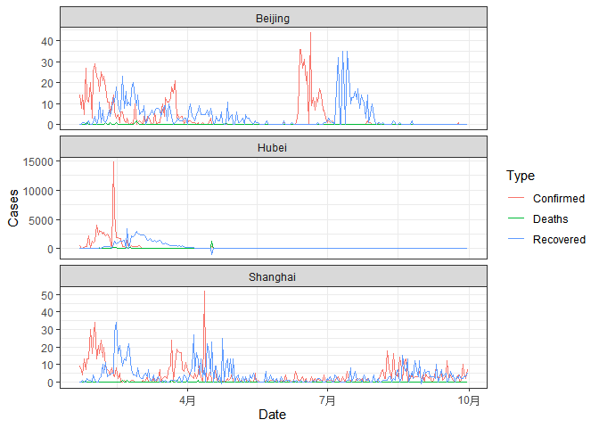

<!-- README.md is generated from README.Rmd. Please edit that file -->

# COVID19CHN

<!-- badges: start -->

<!-- badges: end -->

The goal of COVID19CHN is to help launching the shiny app with datasets
and functions, which helps with basic analysis of COVID-19 daily cases
of every province in China, including confirmed cases, death cases and
recovered cases as of 30 September 2020.

## Installation

You can install the development version of COVID19CHN from
[GitHub](https://github.com/) with:

``` r
# install.packages("devtools")
devtools::install_github("etc5523-2020/r-package-assessment-Lulu-Pi")
```

## Example

This is a basic example which shows you what the package includes:

### The dataset of COVID-19 daily cases in each province in China

    #> # A tibble: 8,349 x 8
    #>    `Province/State`   Lat  Long Date       Confirmed Deaths Recovered Month
    #>    <chr>            <dbl> <dbl> <date>         <dbl>  <dbl>     <dbl> <dbl>
    #>  1 Anhui             31.8  117. 2020-01-22         1      0         0     1
    #>  2 Anhui             31.8  117. 2020-01-23         8      0         0     1
    #>  3 Anhui             31.8  117. 2020-01-24         6      0         0     1
    #>  4 Anhui             31.8  117. 2020-01-25        24      0         0     1
    #>  5 Anhui             31.8  117. 2020-01-26        21      0         0     1
    #>  6 Anhui             31.8  117. 2020-01-27        10      0         0     1
    #>  7 Anhui             31.8  117. 2020-01-28        36      0         0     1
    #>  8 Anhui             31.8  117. 2020-01-29        46      0         2     1
    #>  9 Anhui             31.8  117. 2020-01-30        48      0         0     1
    #> 10 Anhui             31.8  117. 2020-01-31        37      0         1     1
    #> # ... with 8,339 more rows

### The COVID-19 cases per month from January in China

<table class="table table-striped table-hover" style="margin-left: auto; margin-right: auto;">

<thead>

<tr>

<th style="text-align:right;">

Month

</th>

<th style="text-align:left;">

Province/State

</th>

<th style="text-align:right;">

Confirmed

</th>

<th style="text-align:right;">

Deaths

</th>

<th style="text-align:right;">

Recovered

</th>

</tr>

</thead>

<tbody>

<tr>

<td style="text-align:right;">

1

</td>

<td style="text-align:left;">

Anhui

</td>

<td style="text-align:right;">

237

</td>

<td style="text-align:right;">

0

</td>

<td style="text-align:right;">

3

</td>

</tr>

<tr>

<td style="text-align:right;">

1

</td>

<td style="text-align:left;">

Beijing

</td>

<td style="text-align:right;">

139

</td>

<td style="text-align:right;">

1

</td>

<td style="text-align:right;">

5

</td>

</tr>

<tr>

<td style="text-align:right;">

1

</td>

<td style="text-align:left;">

Chongqing

</td>

<td style="text-align:right;">

211

</td>

<td style="text-align:right;">

0

</td>

<td style="text-align:right;">

1

</td>

</tr>

<tr>

<td style="text-align:right;">

1

</td>

<td style="text-align:left;">

Fujian

</td>

<td style="text-align:right;">

120

</td>

<td style="text-align:right;">

0

</td>

<td style="text-align:right;">

0

</td>

</tr>

<tr>

<td style="text-align:right;">

1

</td>

<td style="text-align:left;">

Gansu

</td>

<td style="text-align:right;">

29

</td>

<td style="text-align:right;">

0

</td>

<td style="text-align:right;">

0

</td>

</tr>

<tr>

<td style="text-align:right;">

1

</td>

<td style="text-align:left;">

Guangdong

</td>

<td style="text-align:right;">

436

</td>

<td style="text-align:right;">

0

</td>

<td style="text-align:right;">

11

</td>

</tr>

<tr>

<td style="text-align:right;">

1

</td>

<td style="text-align:left;">

Guangxi

</td>

<td style="text-align:right;">

87

</td>

<td style="text-align:right;">

0

</td>

<td style="text-align:right;">

2

</td>

</tr>

<tr>

<td style="text-align:right;">

1

</td>

<td style="text-align:left;">

Guizhou

</td>

<td style="text-align:right;">

29

</td>

<td style="text-align:right;">

0

</td>

<td style="text-align:right;">

2

</td>

</tr>

<tr>

<td style="text-align:right;">

1

</td>

<td style="text-align:left;">

Hainan

</td>

<td style="text-align:right;">

52

</td>

<td style="text-align:right;">

1

</td>

<td style="text-align:right;">

1

</td>

</tr>

<tr>

<td style="text-align:right;">

1

</td>

<td style="text-align:left;">

Hebei

</td>

<td style="text-align:right;">

82

</td>

<td style="text-align:right;">

1

</td>

<td style="text-align:right;">

0

</td>

</tr>

</tbody>

</table>

### COVID19 daily cases trend in China


